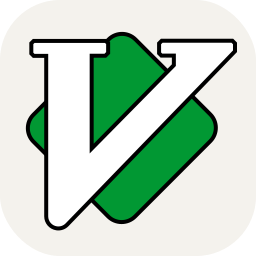

<h1 align="center">Hi , I'm Mahmoud Gadallah</h1>

<picture> </picture>

<!--About me-->
## <picture></picture> About me
 

- 🏫 Computer Engineering Student at [**Faculty of Engineering Mansoura University**](http://engfac.mans.edu.eg/en)
- Currently Enrolled on Meta Backend Specialization
- <picture></picture> Participate in ECPC 2022  => [**Certificate**](pic/2023-ECPCQDAYEIGHT2022-Mahmoud%20Gadallah-PLACE.png)
- <picture></picture> Participate in IEEEXtreme 16.0 || Rank(18 on `Egypt` & 640 `global`)  => [**Rank**](pic/IEEE_Rank.jpg)
- 💻 I am a competitive programmer at `Codeforces`, `Leetcode`, `Codechef`
- 🌱 I’m currently learning Computer Science
- 🤓 Always Learning new things
- 📫 How to reach me **[Linkedin](https://www.linkedin.com/in/m7moudgadallah/)**
- **[My Resume](https://drive.google.com/file/d/1uwg03JfkjRj933TbJI6Mzc4cX5C7RkIc/view?usp=sharing)**

<!--contact with me-->
##  Connect with me

	
	
	
	

<!--My competitive Programing Profiles-->
##  My Competitive Programming Profiles

    &emsp;
  
	  &emsp; 
	
	  &emsp; 
	
	  &emsp; 
    
      &emsp;
	     
	  &emsp; 

<!--My Skills-->
##  My Skills

<!--Programming-->
###  Programming languages

    &emsp;
    
    &emsp;
    
    &emsp;
    
    &emsp;
    
        &emsp;
    
        &emsp;
    

<!--Software & Tools-->
 ###   Software & Tools
 

    &emsp;
    
    &emsp;
    
    &emsp;
    
    &emsp;
        
    &emsp;
        
    &emsp;
    
    &emsp;
    
    &emsp;
    
    &emsp;
    

<!--IDEs-->
 ###  IDEs
 

    &emsp;
    
    &emsp;
    
    &emsp;
    
    &emsp;
    
    &emsp;  

<!--OS-->
 ###   Operating Systems

    &emsp;
    
    &emsp;
    
    &emsp;
    
    &emsp;
    
    &emsp;

  

  

&nbsp;

